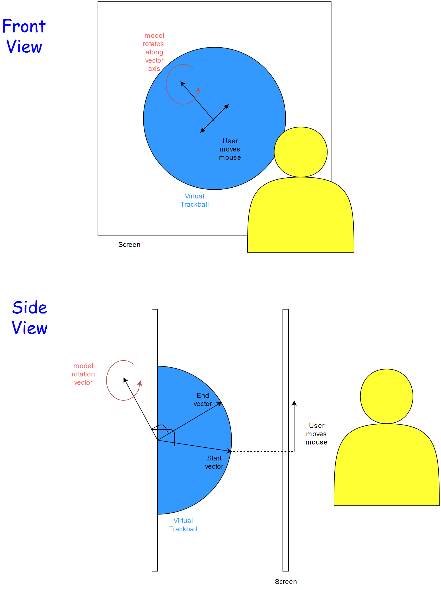
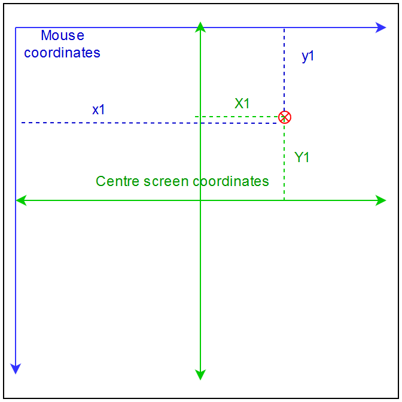
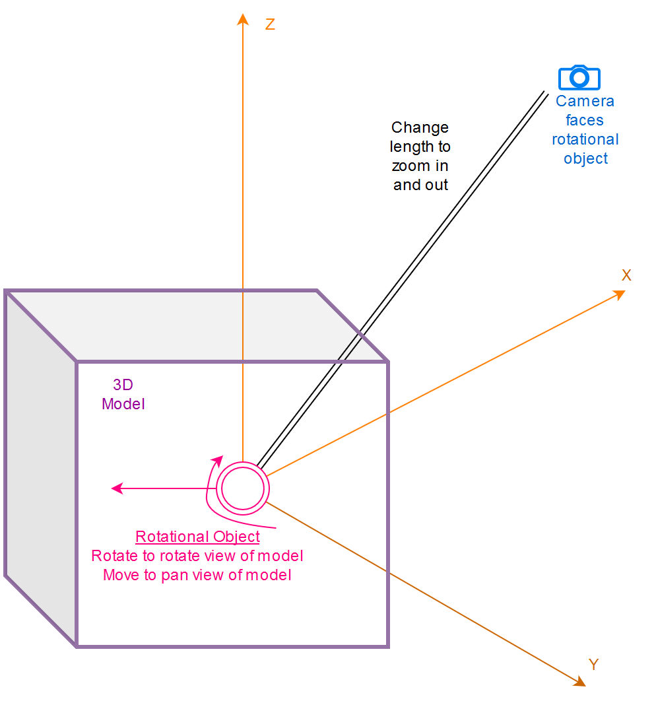

# Geometry of a 3D Virtual Sphere Controller

This describes the geometry calculations and structure of the 3D virtual sphere or trackball controller:  
[https://github.com/AuScope/geomodelportal/blob/main/ui/src/assets/ThreeDVirtSphereCtrls.ts](https://github.com/AuScope/geomodelportal/blob/main/ui/src/assets/ThreeDVirtSphereCtrls.ts)

# Part 1: How to create the illusion of a virtual sphere

**Figure 1: Geometry of virtual sphere controller**

**Figure 2: Converting from mouse coordinates to centre screen coordinates**

You move the mouse and the model moves as if suspended in a ball - a virtual trackball.

How?

1.   The mouse moves from mouse coordinate (x1, y1) → (x2, y2)
2.  Convert (x1,y1) and (x2,y2) to coordinates centred on the centre of screen (X1, Y1) and (X2, Y2) (See Figure 2)
3.  Because we are talking about a sphere you can convert (X1, Y1) to 3D coordinates: \[X1, Y1, √(R2 - X12 - Y12)\], where R = radius of sphere. This is the start vector. (See Figure 1)
4.  Similarly convert (X2, Y2) to 3D coordinates  \[X2, Y2, √(R2 - X22 - Y22)\], This is the end vector.
5.  The rotational axis for the model is the cross product of start vector and end vector ([https://en.wikipedia.org/wiki/Cross\_product](https://en.wikipedia.org/wiki/Cross_product))

# Part 2: Model and camera control

**Figure 3: How the camera is controlled, in a simple diagram**

The virtual sphere controller has three camera control functions:

1.  Zoom towards/away from model
2.  Rotate model
3.  Pan ([**https://en.wikipedia.org/wiki/Panning\_(camera)**](https://en.wikipedia.org/wiki/Panning_\(camera\))**)**

The model stays in the same place in 3D space, and the camera is moved around according to the whims of the user.

Using the ThreeJS library ([https://threejs.org/](https://threejs.org/)), the rotational object (r-object) is added to the scene, positioned at the centre of the model. (See Figure 3).

It is not visible.

Then the camera is added to the r-object at a position some distance away from the rotational centre.

Why add the camera to the r-object, and not directly to the scene?

Well, in ThreeJS, adding object X to object Y, it is a bit like adding wheels to a motor car. If the car moves or rotates, being attached, the wheels will follow.

So if you move the r-object, the camera will move also and the view of the model will be of panning.

If you rotate the r-object, the camera will rotate about the model, a bit like being on the end of a long stick, and the view will be of the model rotating.

To perform a zoom in operation, you need to shorten the length of the distance between camera and r-object.

Conversely, lengthen this distance for a zoom out operation.